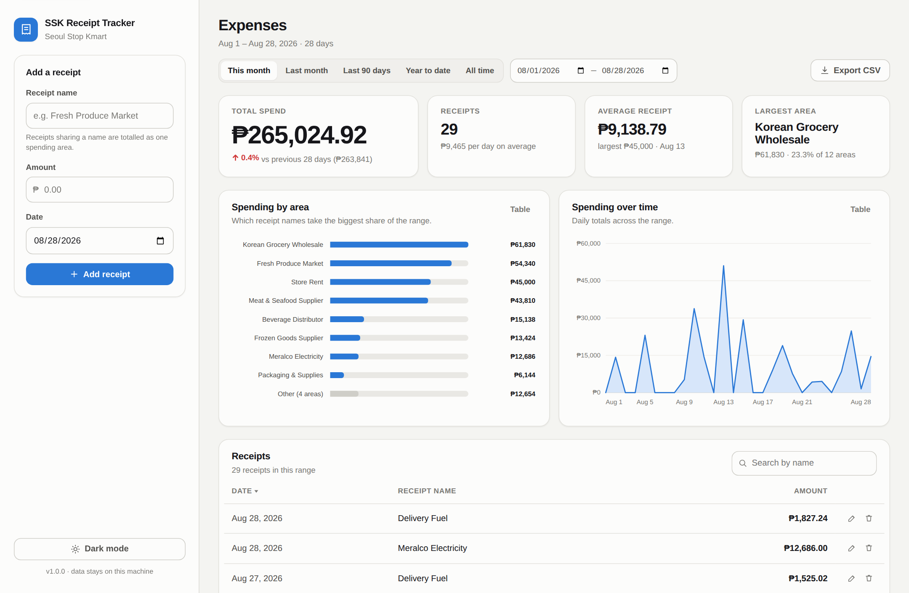
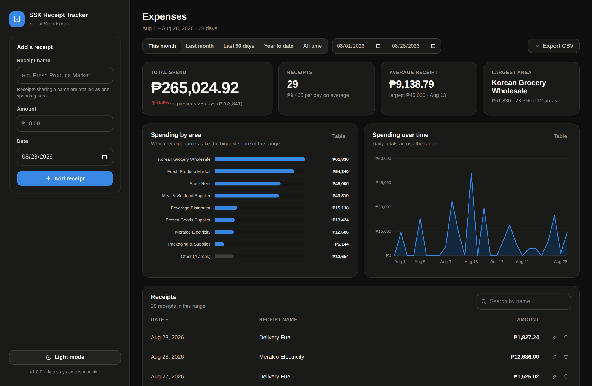

# SSK Receipt Tracker

A small Flask app for logging store receipts and turning them into a monthly
expense picture. Built for **Seoul Stop Kmart**: type in a receipt, pick a date
range, and see the total, the trend, and which area is eating the budget.

| Light | Dark |
|---|---|
|  |  |

## What it does

- **Three fields, nothing more** — receipt name, amount, date. That is the whole
  entry form.
- **Filter by date range** — five presets (this month, last month, last 90 days,
  year to date, all time) or any custom start/end. Every number and both charts
  follow the filter.
- **Spending by area** — receipts sharing a name are one *area* (`Meralco`,
  `meralco` and `MERALCO ` all roll up together), ranked largest first. The tail
  past the top 8 folds into a single "Other" bar rather than becoming noise.
- **Spending over time** — daily, weekly or monthly buckets, picked automatically
  from how long the range is, with empty periods drawn as zero rather than
  skipped.
- **Headline numbers** — total, receipt count, average receipt, the largest area,
  and the change against the equally long period immediately before.
- **Edit, delete, undo** — every delete offers a one-click undo.
- **CSV export** for the current range, ready to hand to a bookkeeper.
- Light and dark themes, keyboard-navigable charts, and a table view of every
  figure so no value is only reachable by hovering.

## Quick start

```bash
cd SSKReceiptTracker
python3 -m venv .venv && source .venv/bin/activate   # optional but recommended
pip install -r requirements.txt
python run.py
```

Open <http://127.0.0.1:5000>. The database is created on first run at
`instance/receipts.sqlite3`.

### Want sample data to look at first?

```bash
flask --app sskreceipts seed-db --months 8
```

That writes ~250 realistic receipts (suppliers, utilities, rent) into the same
database. Delete `instance/receipts.sqlite3` to start clean again.

## Configuration

Everything is an environment variable, all optional:

| Variable | Default | Purpose |
|---|---|---|
| `SSK_CURRENCY` | `PHP` | `PHP`, `USD`, `NZD`, `AUD`, `EUR`, `GBP`, `KRW` |
| `SSK_STORE_NAME` | `Seoul Stop Kmart` | Shown under the app name |
| `SSK_DATABASE` | `instance/receipts.sqlite3` | Path to the SQLite file |
| `DATABASE_URL` | *(unset)* | A Postgres URL. Set it and the app uses Postgres instead of SQLite — required on Vercel, see below |
| `SSK_HOST` / `SSK_PORT` | `127.0.0.1` / `5000` | Dev server binding |
| `SSK_DEBUG` | `1` | Set to `0` for a quiet server |

```bash
SSK_CURRENCY=NZD SSK_STORE_NAME="My Store" python run.py
```

## Deploying to Vercel

The app runs on Vercel as a single Python function (`api/index.py`, routed by
`vercel.json`). **It needs a Postgres database to be useful there** — see the
warning below before you start.

1. **Import the repo.** Vercel dashboard → *Add New… → Project* → import
   `Website-Projects` → set **Root Directory** to `SSKReceiptTracker` →
   Framework Preset **Other** → Deploy.
2. **Add a database.** Project → **Storage** → *Create Database* → **Neon
   (Postgres)** → connect it to the project. That sets `DATABASE_URL` for you.
3. **Redeploy** so the function picks up the variable. The tables create
   themselves on the first request.

Optionally set `SSK_CURRENCY` and `SSK_STORE_NAME` under *Settings →
Environment Variables*.

From the CLI instead:

```bash
cd SSKReceiptTracker
npx vercel link
npx vercel env add DATABASE_URL production   # paste your Postgres URL
npx vercel --prod
```

Check `https://<your-deployment>/healthz` afterwards — it reports which backend
is live:

```json
{ "ok": true, "version": "1.0.0", "database": "postgres" }
```

### Why a database is required there, and not locally

Vercel functions get a **read-only filesystem with an ephemeral `/tmp`** that is
not shared between instances. A SQLite file written during one request is gone
by the next, so every receipt entered would be lost —
[Vercel says as much](https://vercel.com/kb/guide/is-sqlite-supported-in-vercel).

Rather than let that happen quietly, the app **refuses to start** on a
serverless host with no `DATABASE_URL` and serves a page explaining how to
connect one. (`SSK_ALLOW_EPHEMERAL_DB=1` overrides it for a throwaway demo where
losing the data does not matter.)

Locally there is no such problem, so local runs still need zero configuration
and keep using SQLite.

> **Note:** the deployed app has no authentication — anyone with the URL can
> read and edit the receipts. Either keep the URL private, put Vercel's
> [password protection](https://vercel.com/docs/deployment-protection) in front
> of it, or run it on the shop's own machine instead. If a login is wanted, say
> so and it is a small addition.

### Alternatives worth knowing about

| Host | What changes |
|---|---|
| **Vercel + Neon Postgres** | as above; the documented path |
| **Any Postgres** (Supabase, RDS, a VPS) | just set `DATABASE_URL` |
| **Render / Fly.io / Railway** | attach a persistent disk and the original SQLite setup works unchanged — no database to provision |

## Running it on your own machine

`run.py` starts Flask's development server, which is fine on a counter PC. For
anything longer-lived, put a WSGI server in front:

```bash
pip install waitress
waitress-serve --host 127.0.0.1 --port 8000 --call sskreceipts:create_app
```

The app has **no authentication** — it assumes a single trusted machine. Bind it
to `127.0.0.1` (the default) rather than exposing it on a network.

**Backups are one file.** Copy `instance/receipts.sqlite3` (plus any `-wal` /
`-shm` files beside it) and you have copied everything.

## Tests

```bash
python -m unittest discover -s tests -v
```

27 tests cover money parsing, field validation, the aggregations behind the
charts, the storage layer, the serverless guard, and every API route including
the error paths.

The 10 Postgres tests are skipped unless you point them at a database — they
re-run the API suite on the engine the deployment actually uses:

```bash
TEST_DATABASE_URL=postgresql://user:pw@host/db python -m unittest discover -s tests -v
```

## How it is put together

```
sskreceipts/
├── __init__.py       app factory, page route, /healthz
├── config.py         env-var configuration, currency table, serverless guard
├── storage.py        SQLite and Postgres behind one connection interface
├── db.py             the SQL, plus the `init-db` / `seed-db` CLI
├── money.py          amount parsing; integer centavos, never floats
├── validation.py     name/date rules and the area grouping key
├── stats.py          aggregations: areas, time buckets, period comparison
├── api.py            JSON API + CSV export
├── templates/        the single page
└── static/
    ├── css/app.css   design tokens, light + dark
    └── js/
        ├── charts.js hand-rolled SVG bar + area charts
        └── app.js    fetching, rendering, form handling
```

Three decisions worth knowing about:

- **Amounts are integer centavos.** Binary floats cannot represent `0.10`, so a
  month of receipts summed as floats drifts. Parsing happens once, at the edge;
  everything inside is integer arithmetic.
- **The charts are hand-drawn SVG, not a charting library.** Two simple figures
  did not justify a dependency, and drawing them directly keeps the app fully
  offline and gives exact control over the marks.
- **One request per filter change.** `/api/dashboard` returns the receipts *and*
  every aggregate for a range, so the browser never re-derives a total the
  server already computed.
- **Two backends, one set of SQL.** Statements are written once in SQLite's `?`
  placeholder style and translated for Postgres, and both schemas store dates as
  ISO text so a row has the same shape on either engine. Local behaviour and
  deployed behaviour cannot quietly diverge.

## A note on "areas"

The app groups spending by **receipt name** — that is what makes the "largest
area" answer work with only three input fields. Name receipts consistently
(`Fresh Produce Market` every time, not `produce` one week and `veg supplier` the
next) and the breakdown stays meaningful; the name box autocompletes from what
you have already used, ordered by how often you use it.

If you later want a separate category per receipt (so several vendors can roll
up into "Utilities"), that is a `category` column in `db.py`, a fourth form
field, and a second grouping key in `stats.py`.
